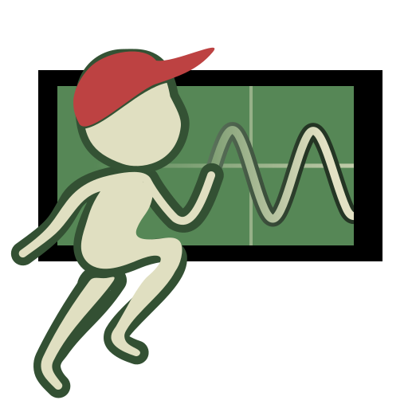
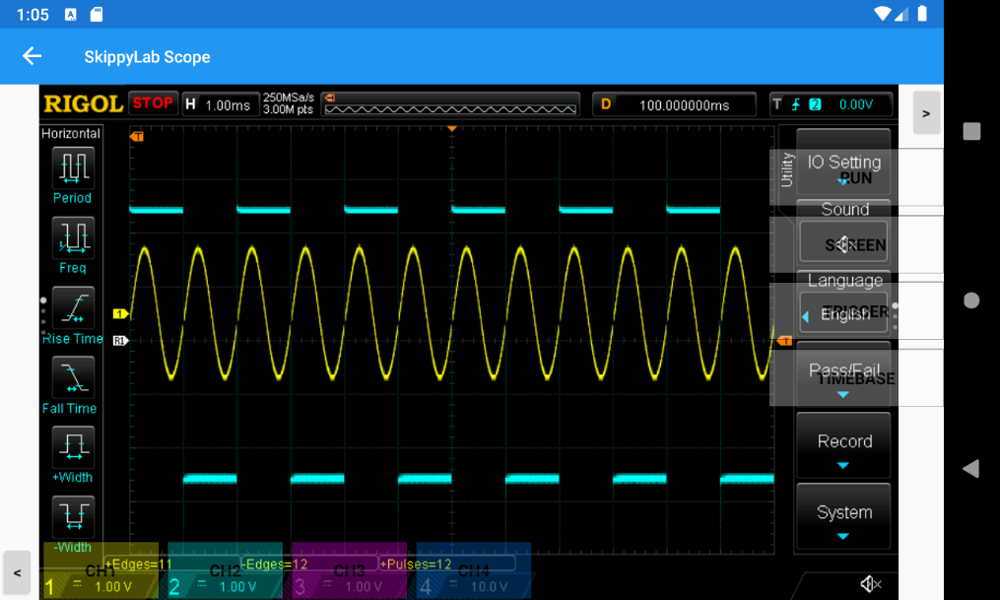
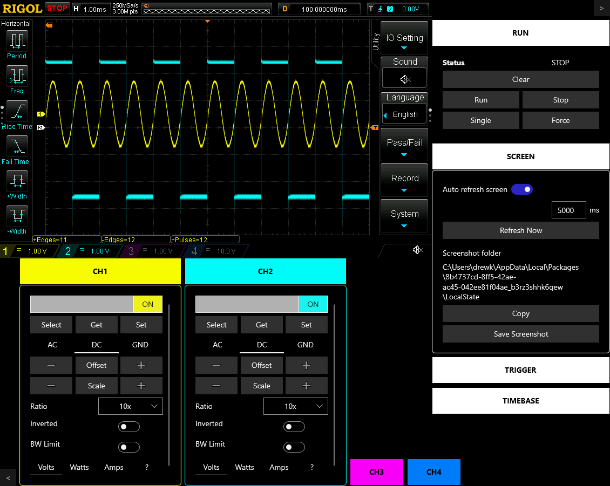

# SkippyLab
Provides an interface to lab equipment via a protocol called SCPI. SkippyLab provides remote monitoring and control and an easy way to get a screnshot of the scope screen on your computer or handheld device. Common scope usages have been implmemented (four channels, timebase control, edge triggering) and works similar to someone sitting in front of the scope pushing buttons and dialing knobs. Currently only Rigol MSO/DS1000Z oscilloscopes are implemented.

SkippyLab runs on Windows and Android. There is a project stub for iOS, but I don't have a Mac nor a way to build that part of the project, so it has not been developed.

SkippyLab on Google Play: (TBD)
SkippyLab on Windows Store: (TBD)

Android Phone

Windows Desktop

## Technical Notes

Xamarin Forms is at work to provide multi-platform support. A project for WPF is also included, but WPF support in Xamarin itself is experimental, and some of the Nuget sources don't provide WPF support, so the WPF  project here is not fully developed.

This is my first project using ReactiveUI, so I imagine there is opportunity for improvement in the code.